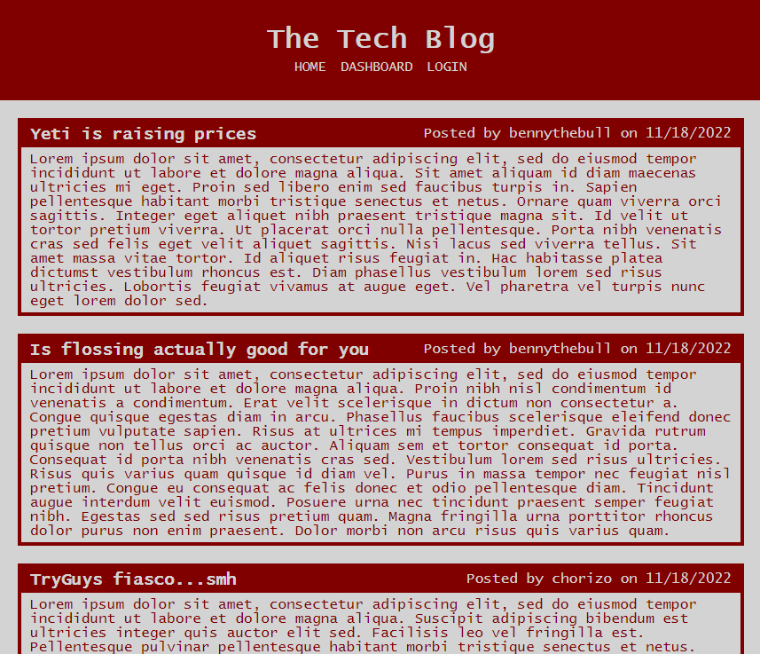
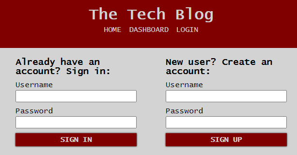
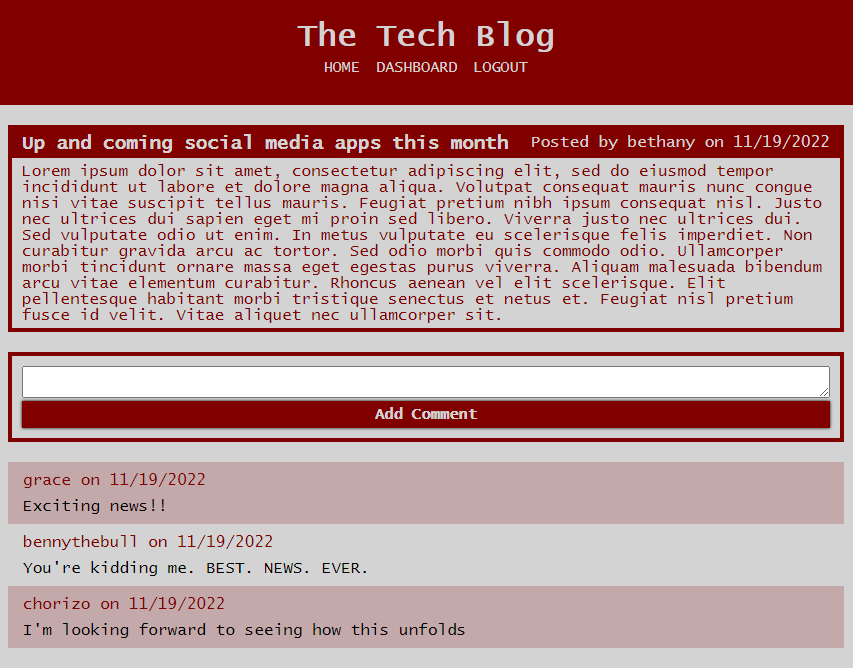
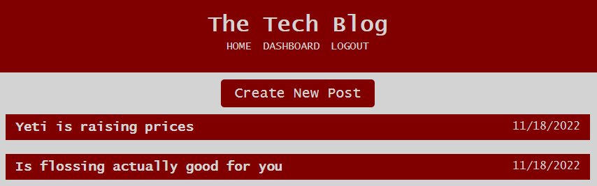
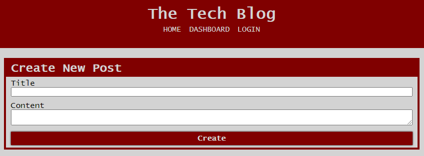
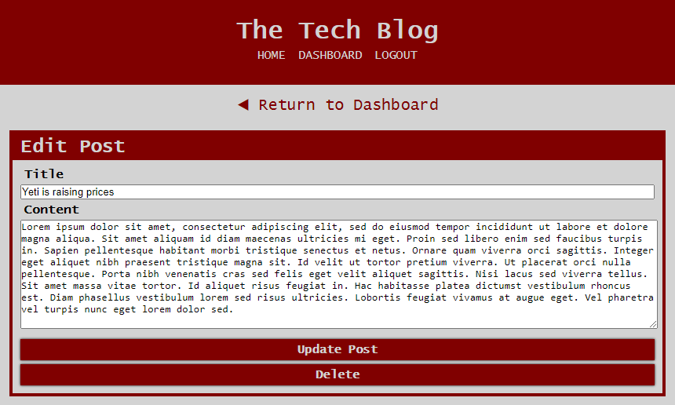

# The Tech Blog

## Description

In addition to making technical contirbutions to technology, developers have interesting thoughts and opinions they may choose to share with the tech community. This CMS-style blog I have created facilitates the sharing of these ideas, and also allows other community members to express there opinions on these thoughts.

Using the Model-View-Controller architectural pattern (components: Handlebars.js, Sequelize, express-session npm package), I was able to develop this blog site by practicing the skills I have learned through this point. This was a heavy challenge, but a fun one to execute and see come together in the final product.

## Installation

Clone the repo, then from the command line, run `npm install` in the project's root directory to download any dependencies.

## Usage

The deployed application can be found [here](https://the-tech-blog-876.herokuapp.com/).

Upon first loading the application, the home page shows existing blog posts as well as options to view different pages, including the option to log into the site.

The login page allows an existing user to enter their credentials, or create a new account. The user is logged out automatically after a 5-minute period of inactivity.

If the user is logged in, when they click on a post on the home page, they are taken to a page which shows that post only, and they are able to add a comment, as well as view comments. If the user is not logged in, they will not see the option to add a comment.

The user's dashboard will show the title of any posts they have created. The option to create a new post sits above the existing posts.

This page appears whe the user clicks the **Create New Post** button.

From the dashboard, if the user clicks on one of their post titles, they will be taken to a page where they can either edit the title/content of the existing post, or delete it entirely.

## License

Please see repo for license information.
